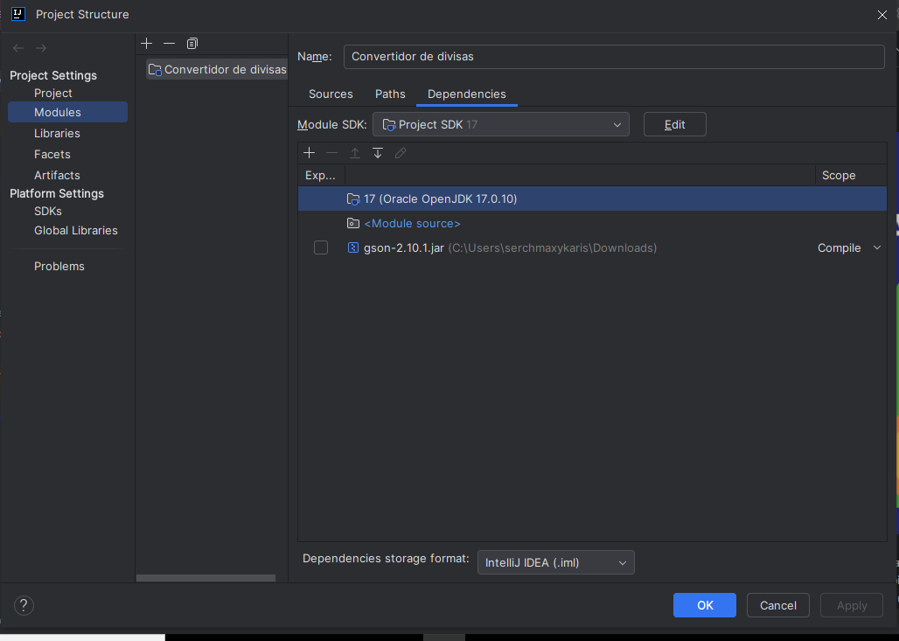

# Calculadora de divisas

La Calculadora de divisas es una aplicación Java que permite a los usuarios convertir entre diferentes monedas utilizando los tipos de cambio actuales. Esta aplicación ofrece una interfaz de línea de comandos donde los usuarios pueden ingresar la divisa de origen y la divisa de destino, así como la cantidad que desean convertir. Además, proporciona una funcionalidad para mostrar una lista de divisas disponibles y sus códigos, nombres y países asociados.

## Instalación

1. Clona este repositorio.

## Uso
Es indispensable validar que el menu de Intelij, en la opcion de Project Structure... en el apartado de Modulos este el archivo gson-2.10.1.jar de lo contrario en la carpeta delproyecto de nombre gson-2.10.1 se incluye solo es necesario dar clic en el simbolo de mas y elegir dicho archivo
para poder inicializar correctamente el sistema 

Al iniciar la aplicacion desde la clase Principal Mostrara el siguiente menù

Al seleccionar la opcion 1 podras desplegar el catalogo existento

De lo contrario o inmediatamente despues de visualizar el catalogo disponible deberas colocar las divisas de Origen (divisa que deseas intercambiar) y la divisa destino (Divisa que deseas obtener) una vez colocados ambo elementos devolvera el tipo de cambio

En caso de haber cescrito erronamente alguna divisa o de no haberse encontrado dentro del catalogo devolvera el siguiente error, e inmediatamente solictara de nuevo escriba las divisas de Origen y Destino

Si la consulta la API fue exitosa y devuelve el tipo de cambio solictara escribas la cantidad a convertir, 
Automaticamente el sistema realizara el calculo de la equivalencia entre ambas divisas
Y solicitara reiniciar el bucle, presionando enter, de lo contrario al escribir Exit Saldra del sistema y antes creara un archivo de Json dentro de la carpeta de proyecto con el nombre TiposDeCambio.json con las consultas realizadas al API

Ejemplo archivo "TiposDeCambio.json"

## Contribución

Si deseas contribuir a este proyecto, sigue estos pasos:

1. Haz un fork del repositorio.
2. Crea una nueva rama (`git checkout -b feature/nueva-funcionalidad`).
3. Haz commit de tus cambios (`git commit -am 'Agrega nueva funcionalidad'`).
4. Haz push a la rama (`git push origin feature/nueva-funcionalidad`).
5. Abre un Pull Request.

## Créditos
Este proyecto es creado gracias a Alura Latam, Oracle OneNext Education, 

Especial atencion a los instructores de Alura Latam

Bruno Darío Fernandez Ellerbach

Génesys Rondón

Christian Velasco